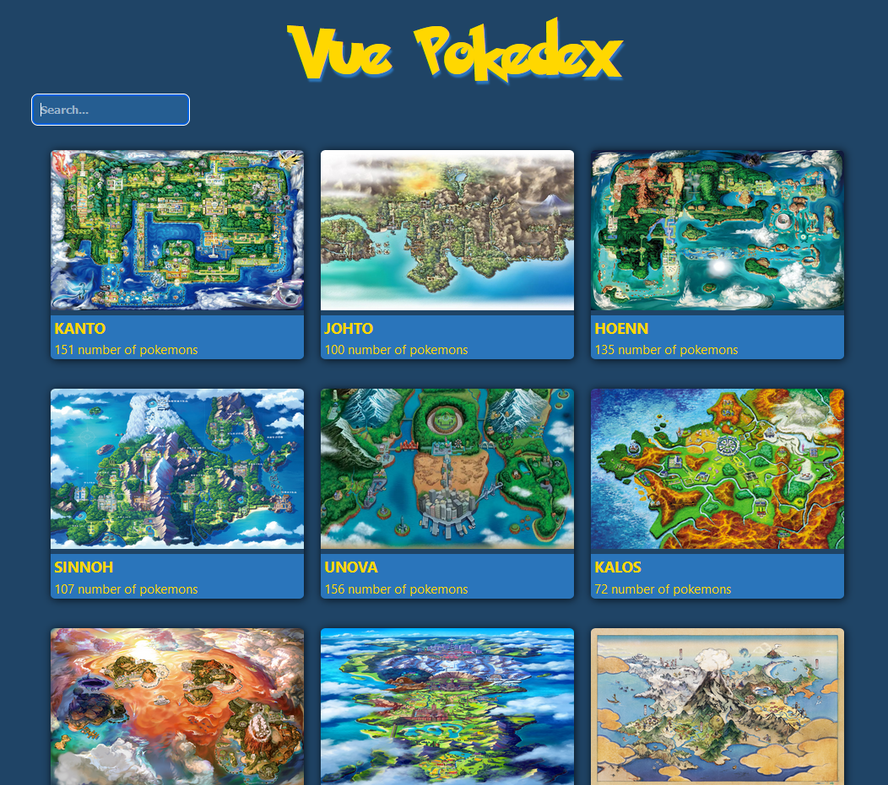
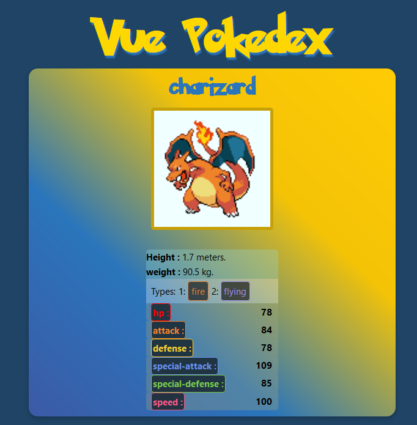

# Pokédex
A project where i'm testing out Vue.js and features such as states, binding, routing, props and much more 😁
Work in progress, watch the current state of the app in this live demo -> https://soft-chimera-f82e04.netlify.app/

# The pokémons can be searched from region to region. 

# You can also view stats on a specific pokémon. 

